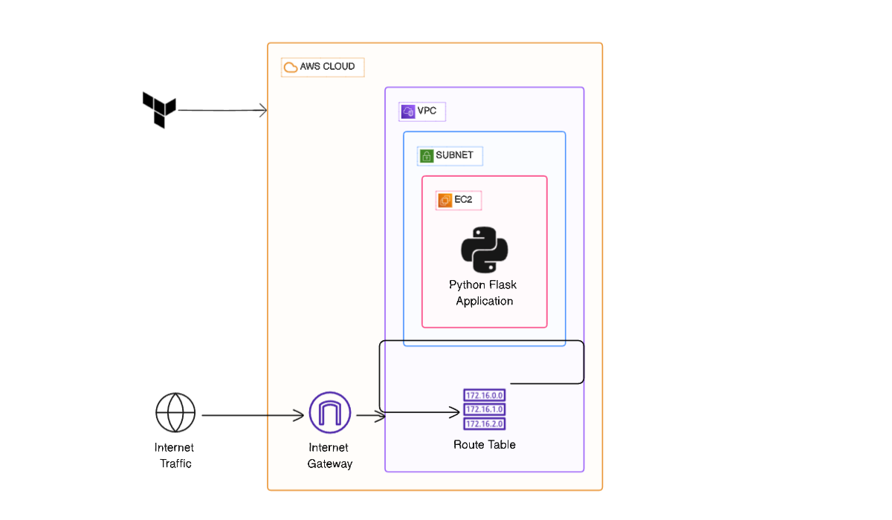
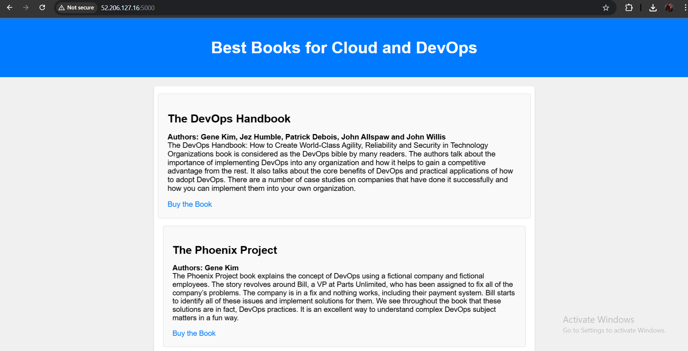

# Flask-AWS-Deploy-with-Terraform

##  Description

This project demonstrates how to provision AWS infrastructure and deploy a simple Flask web application automatically using Terraform provisioners.

The infrastructure includes:

- A VPC with a public subnet.
- An Internet Gateway and Route Table for internet access.
- A Security Group allowing HTTP (80), HTTPS (443), Flask app port (5000), and SSH (22).
- An EC2 instance with Ubuntu.
- Terraform provisioners to:
  - Upload the Flask application (app.py + templates/).
  - Install Python3 & Flask.
  - Run the Flask app in the background.
 


##  How to Run

### Prerequisites
- AWS account with an IAM user (programmatic access).
- Terraform installed on your local machine.
- An SSH key pair (id_rsa, id_rsa.pub).

### Clone the Repository
```
git clone https://github.com/Omar-268/Flask-AWS-Deploy-with-Terraform.git
cd terraform-aws-flask-deploy
```
### Initialize & Apply Terraform Configuration
```
terraform init
terraform plan
terraform apply
```
After apply, Terraform will output the Public IP and Public DNS:
```
instance_public_ip = xx.xx.xx.xx
instance_public_dns = ec2-xx-xx-xx-xx.compute-1.amazonaws.com
```
## Preview
Once the Terraform apply is complete, you can access the Flask app in the browser:
```
http://<PUBLIC_IP>:5000
```
You should see the Flask app running

